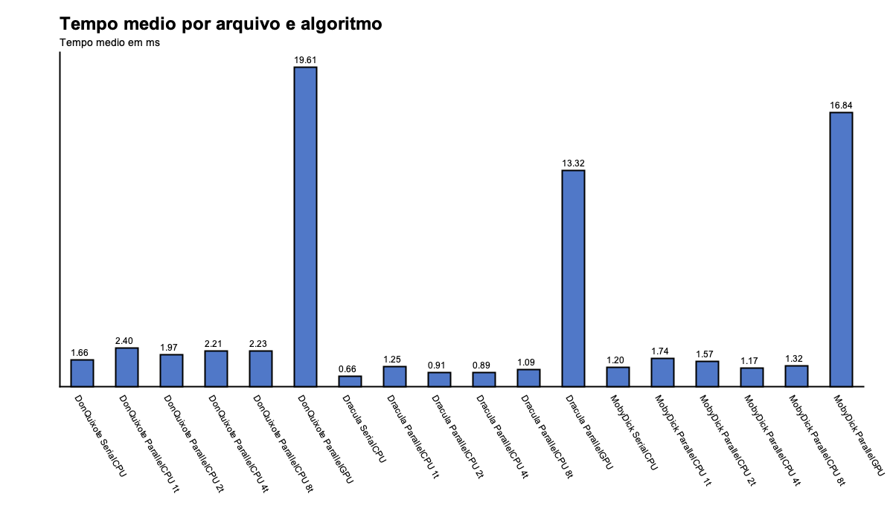
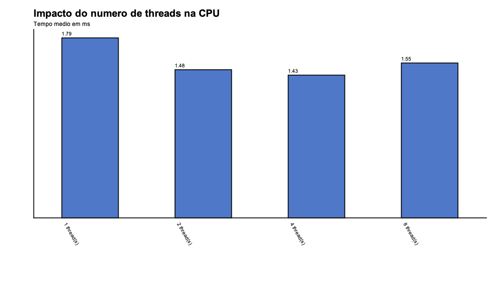

# Análise comparativa de algoritmos com uso de paralelismo

**Disciplina:** Computação concorrente e paralela (AV3)  
**Título do trabalho:** Análise comparativa de algoritmos com uso de paralelismo  
**Integrantes da dupla:** Amanda Fonseca e Luma Brandão

---

## Resumo

Este trabalho implementa e compara três abordagens de contagem de ocorrências de uma palavra em arquivos de texto: execução **serial na CPU** (`SerialCPU`), execução **paralela na CPU** com pool de threads (`ParallelCPU`) e execução **paralela na GPU** com OpenCL via biblioteca JOCL (`ParallelGPU`). Os testes utilizam três obras literárias de tamanhos e idiomas distintos como conjuntos de dados.

Foi desenvolvido um framework de benchmark em Java que executa cada combinação de algoritmo, arquivo e configuração de paralelismo **três vezes**, registra ocorrências e tempos em **CSV** e gera **gráficos PNG** para análise visual. Os resultados indicam que, para o volume e o tipo de operação avaliados (comparação exata de strings tokenizadas), a versão serial permanece competitiva ou superior à CPU paralela, enquanto a GPU apresenta overhead elevado de inicialização e transferência de dados, ficando cerca de **10× a 30× mais lenta** que o serial nos cenários medidos. O paralelismo na CPU mostrou ganho marginal em textos maiores quando configurado com **4 threads**, sem escalonamento linear até 8 threads.

---

## Introdução

A busca por eficiência computacional em processamento de grandes volumes de texto motiva o estudo de algoritmos em ambientes seriais e paralelos. Neste trabalho, a “busca” consiste em **contar quantas vezes uma palavra aparece** em um arquivo `.txt`, após normalização (minúsculas e remoção de pontuação adjacente).

Foram escolhidos três métodos de implementação em Java:

| Método | Descrição |
|--------|-----------|
| **SerialCPU** | Loop simples sobre o vetor de palavras já tokenizadas, em um único thread. |
| **ParallelCPU** | Divisão do vetor em partes iguais; cada parte é processada por uma tarefa em um `ExecutorService` com pool de tamanho configurável (1, 2, 4 ou 8 threads). |
| **ParallelGPU** | Kernel OpenCL (`count_word`) que compara cada palavra do texto com o alvo em paralelo na GPU, utilizando buffers para letras, inícios e comprimentos das palavras. |

A abordagem adotada separa **carregamento e tokenização** (`WordFile`) da **contagem** (cada algoritmo), de modo a medir o tempo gasto especificamente na etapa de contagem, com o texto já preparado em memória. Um módulo `Benchmark` orquestra as execuções repetidas, consolida os resultados e aciona a geração de gráficos (`SimpleCharts`). Foi incluída também uma interface gráfica em Swing (`MainWindow`) para configurar parâmetros, acompanhar a saída dos testes e visualizar os gráficos ao final das execuções.

O objetivo geral é obter uma compreensão mais profunda do desempenho relativo desses algoritmos em ambientes serial, multicore e GPU, identificando em quais condições cada meio de processamento se mostra mais adequado conforme o volume e a natureza dos dados.

---

## Metodologia

A metodologia seguiu cinco etapas: implementação dos algoritmos, construção de um framework de testes, execução em cenários variados, registro dos dados em CSV e análise estatística dos tempos obtidos para identificar padrões de desempenho e comparar os algoritmos sob diferentes condições.

### Implementação de algoritmos

Criação, em Java, de três variantes de contagem de palavras:

1. **SerialCPU** — iteração sequencial com `equals` sobre palavras normalizadas.
2. **ParallelCPU** — particionamento do array `words` em blocos; soma dos parciais retornados por `Future` em pool de threads.
3. **ParallelGPU** — preparação de buffers contíguos de bytes; kernel OpenCL com um work-item por palavra; soma dos matches após leitura dos resultados na CPU.

Cada método recebe o texto tokenizado (`String[] words`) e a palavra alvo, retornando o **número de ocorrências**. O tempo é medido com `System.nanoTime()` em torno da chamada ao método de contagem.

### Framework de teste

Desenvolvimento da classe `Benchmark`, responsável por:

- carregar os arquivos `.txt` da pasta de amostras;
- executar, para cada arquivo, um número fixo de repetições (**3** por padrão);
- em cada repetição, invocar SerialCPU, ParallelCPU (para cada quantidade de threads configurada) e ParallelGPU;
- registrar ocorrências e tempo de cada execução;
- exportar os dados e gerar os gráficos de análise.

A saída de cada teste segue o formato exigido pelo trabalho, por exemplo: `SerialCPU [1]: 1244 ocorrencias em 1.220 ms`.

### Execução em ambientes variados

Os testes variaram **tamanho e natureza** dos conjuntos de dados e **configurações de processamento paralelo**:

| Arquivo | Obra | Idioma | Palavras (aprox.) |
|---------|------|--------|-------------------|
| `DonQuixote-388208.txt` | *Dom Quixote* | Espanhol | 386 784 |
| `Dracula-165307.txt` | *Drácula* | Inglês | 166 773 |
| `MobyDick-217452.txt` | *Moby Dick* | Inglês | 222 559 |

Em cada arquivo foram executados:

- uma versão **serial** (1 núcleo lógico de processamento);
- versões **paralelas na CPU** com 1, 2, 4 e 8 threads;
- versão **paralela na GPU** (OpenCL via JOCL 2.0.4).

A palavra utilizada nos experimentos documentados foi **`whale`**, permitindo observar desde corpora sem ocorrência (*Dom Quixote*) até alto volume de matches (*Moby Dick*). Os tempos registrados refletem o ambiente de hardware e sistema operacional em que as execuções foram realizadas; repetições múltiplas reduzem o efeito de variações pontuais de carga da máquina.

### Registro de dados

Os tempos de execução, ocorrências e metadados de cada teste foram armazenados no arquivo `results/results.csv`, com as colunas: `arquivo`, `palavra`, `algoritmo`, `processadores`, `execucao`, `ocorrencias`, `tempo_ms` e `total_palavras`. Esse formato facilita reprocessamento, comparação com estudos futuros e geração automática dos gráficos.

### Análise estatística

Para cada combinação (arquivo, algoritmo e número de threads ou GPU), calculou-se a **média aritmética** dos três tempos registrados. A partir dessas médias foram produzidos:

- `tempo-medio.png` — comparação entre arquivos, algoritmos e configurações de threads;
- `threads-cpu.png` — impacto do número de threads no `ParallelCPU`.

Verificou-se ainda a **consistência funcional**: SerialCPU, ParallelCPU e ParallelGPU devem retornar o mesmo número de ocorrências para a mesma entrada; essa igualdade foi observada em todos os casos, validando as implementações paralelas antes da interpretação dos tempos.

---

## Resultados e Discussão

Os resultados permitem comparar o desempenho relativo dos algoritmos conforme o **volume do conjunto de dados** e o **meio de processamento** (serial, CPU multicore ou GPU), alinhando-se ao que se esperava do estudo: insights sobre qual abordagem é mais adequada em cada cenário e como fatores como tamanho do texto e paralelismo afetam o tempo de execução.

### Consistência das contagens

Com a palavra `whale`:

| Arquivo | Ocorrências |
|---------|-------------|
| Don Quixote | 0 |
| Drácula | 1 |
| Moby Dick | 1 244 |

O zero em *Dom Quixote* (texto em espanhol) e o pico em *Moby Dick* ilustram como a **natureza do corpus** influencia o resultado da busca. Para a análise de desempenho, o relevante é que os três algoritmos concordaram em todos os arquivos.

### Tempos médios por arquivo e meio de processamento (ms)

| Arquivo | SerialCPU | ParallelCPU (4 threads) | ParallelGPU |
|---------|-----------|-------------------------|-------------|
| Don Quixote | 1,660 | 2,213 | 19,611 |
| Drácula | 0,660 | 0,891 | 13,316 |
| Moby Dick | 1,198 | 1,172 | 16,836 |

**Efeito do tamanho e do conteúdo:** *Moby Dick* possui o maior número de palavras e concentra quase todas as ocorrências de `whale`; mesmo assim, os tempos na CPU permaneceram na ordem de **1 a 2 ms** no serial e no paralelo, enquanto a GPU ficou entre **13 e 20 ms**. *Drácula*, menor em volume, teve os menores tempos na CPU (~0,66 ms serial). *Don Quixote*, o maior arquivo em palavras, não elevou proporcionalmente o tempo serial porque a operação por palavra é leve e o custo depende sobretudo do tamanho do vetor percorrido, não da quantidade de matches.

**Serial vs. CPU paralela:** em *Moby Dick*, 4 threads apresentaram média ligeiramente inferior ao serial (~1,17 ms vs. ~1,20 ms). Em *Drácula* e *Don Quixote*, o serial foi **mais rápido** que as configurações paralelas — o overhead de criar tarefas, sincronizar `Future`s e disputar cache supera o ganho para uma comparação simples de `String` em memória.

**GPU:** em todos os arquivos, `ParallelGPU` foi **substancialmente mais lenta** que o serial. O kernel executa em paralelo, mas o problema tem pouco trabalho por palavra; o tempo é dominado por **inicialização do OpenCL**, cópia de buffers e leitura dos resultados. Para este volume de dados, a GPU não é o meio mais adequado; corpora muito maiores ou kernels mais pesados seriam necessários para compensar o custo fixo.

### Impacto do número de threads na CPU

Média do `ParallelCPU` considerando os três arquivos:

| Threads | Tempo médio (ms) |
|---------|------------------|
| 1 | 1,795 |
| 2 | 1,481 |
| 4 | 1,425 |
| 8 | 1,546 |

Há melhora ao passar de 1 para 4 threads, mas **8 threads não mantêm o ganho** — possível contenção de memória e custo de agendamento sem trabalho útil proporcional. O gráfico `threads-cpu.png` evidencia esse patrão: existe um ponto intermediário (4 threads) mais favorável que extremos muito baixo ou muito alto de paralelismo para esta carga.

### Demonstração dos gráficos

**Gráfico 1 — Tempo médio por arquivo e algoritmo** (`tempo-medio.png`):



Permite comparar, lado a lado, serial, paralelo com diferentes threads e GPU em cada obra. Visualmente, as barras da GPU destoam por serem muito maiores; as barras da CPU paralela se misturam com o serial em *Moby Dick* e ficam acima do serial nos outros dois textos.

**Gráfico 2 — Impacto do número de threads** (`threads-cpu.png`):



Resume o comportamento do `ParallelCPU` isolando o fator “número de threads”, reforçando que aumentar paralelismo não garante redução monotônica do tempo.

### Exemplo de registro de uma execução

```
Arquivo: MobyDick-217452.txt
Total de palavras lidas: 222559
SerialCPU [1]: 1244 ocorrencias em 1.220 ms
ParallelCPU [4]: 1244 ocorrencias em 0.973 ms
ParallelGPU [GPU]: 1244 ocorrencias em 16.964 ms
```

Os arquivos CSV e PNG gerados complementam essa visão pontual com o histórico das três repetições por configuração, base da análise estatística descrita na metodologia.

---

## Conclusão

O trabalho cumpriu o objetivo de implementar e comparar algoritmos de contagem em ambientes **serial**, **paralelo multicore** e **paralelo em GPU**, com registro sistemático em CSV e visualização em gráficos.

As principais conclusões são:

1. **Correção:** as três implementações produziram contagens idênticas, validando a lógica paralela.
2. **Volume e meio de processamento:** para os tamanhos de texto testados, o processamento **serial na CPU** permaneceu a opção mais estável; a **CPU paralela** só apresentou ganho marginal em *Moby Dick* com 4 threads.
3. **GPU:** o meio GPU foi o menos adequado neste cenário, afetado fortemente por overhead de setup e transferência, e não pelo custo da comparação em si.
4. **Threads:** o desempenho não escala linearmente com o número de núcleos lógicos utilizados; há configuração intermediária mais eficiente que o excesso de threads.

Em conjunto, os resultados oferecem uma base para desenvolvedores e pesquisadores que desejam otimizar algoritmos em sistemas multicore e GPU: o paralelismo só se justifica quando o trabalho por unidade de dados é grande o suficiente para amortizar sincronização e comunicação. O material em CSV e nos gráficos permite reproduzir e estender a análise em trabalhos futuros sobre computação concorrente e paralela.

---

## Referências

- Oracle Corporation. *Java Platform, Standard Edition Documentation* — `ExecutorService`, `Swing`. https://docs.oracle.com/en/java/
- Khronos Group. *OpenCL Specification*. https://www.khronos.org/opencl/
- JOCL Project. *Java bindings for OpenCL (JOCL 2.0.4)*. https://github.com/gpu/JOCL
- Maven Central. *jocl 2.0.4*. https://repo1.maven.org/maven2/org/jocl/jocl/2.0.4/
- Project Gutenberg. Obras literárias em domínio público (amostras de texto).

---

## Anexos

Códigos das implementações (`SerialCPU`, `ParallelCPU`, `ParallelGPU`, `Benchmark`, `WordFile`, `CsvWriter`, `SimpleCharts`, `MainWindow`, entre outros):

**https://github.com/lumab23/av3-contador-palavras-paralelo**
